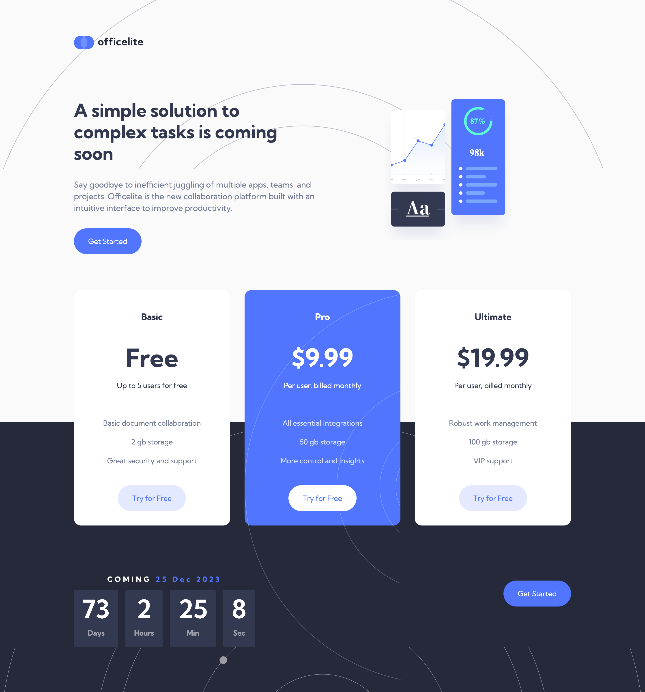
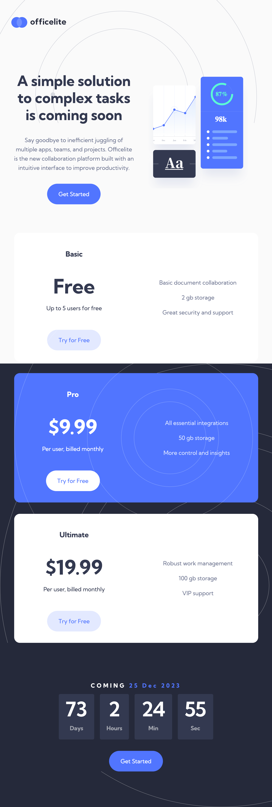
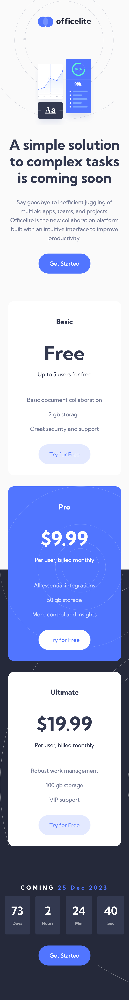
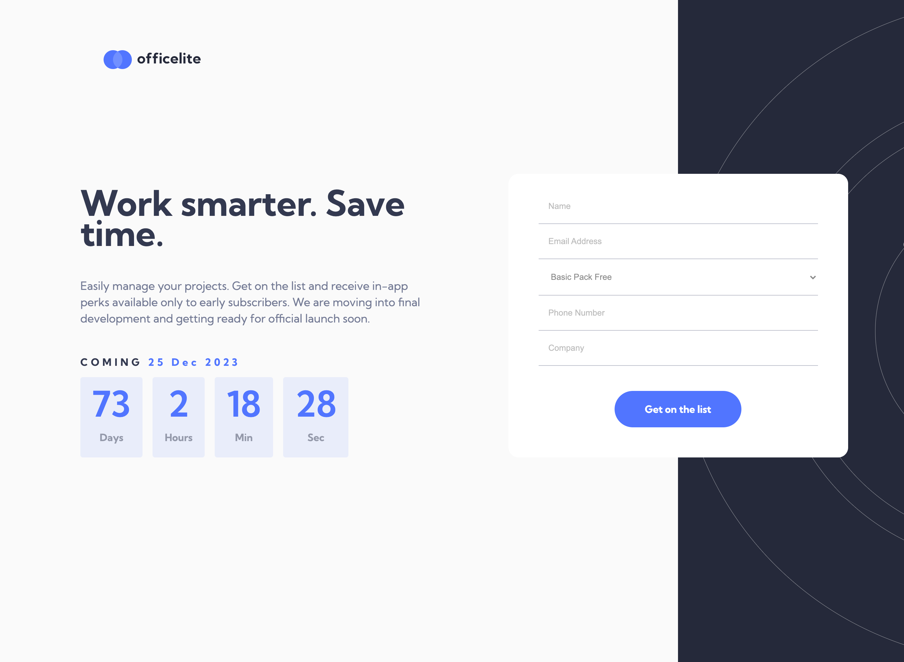

# Frontend Mentor - Officelite coming soon site solution

This is a solution to the [Officelite coming soon site challenge on Frontend Mentor](https://www.frontendmentor.io/challenges/officelite-coming-soon-site-M4DIPNz8g). Frontend Mentor challenges help you improve your coding skills by building realistic projects.

## Table of contents

- [Overview](#overview)
  - [The challenge](#the-challenge)
  - [Screenshot](#screenshot)
  - [Links](#links)
- [My process](#my-process)
  - [Built with](#built-with)
  - [What I learned](#what-i-learned)
  - [Continued development](#continued-development)
  - [Useful resources](#useful-resources)
- [Author](#author)

## Overview

### The challenge

Users should be able to:

- View the optimal layout for the site depending on their device's screen size
- See hover states for all interactive elements on the page
- See error states when the contact form is submitted if:
  - The `Name` and/or `Email Address` fields are empty
  - The `Email Address` is not formatted correctly
- **Bonus**: See a live countdown timer that ticks down every second
- **Bonus**: See a custom-styled `select` form control in the sign-up form

### Screenshot

### Links

- Solution URL: [https://github.com/cwwittor/officelite-coming-soon-site](https://github.com/cwwittor/officelite-coming-soon-site)
- Live Site URL: [https://officelite-coming-soon-site.pages.dev/](https://officelite-coming-soon-site.pages.dev/)

## My process

### Built with

- Semantic HTML5 markup
- CSS custom properties
- Flexbox
- CSS Grid
- Mobile-first workflow
- Javascript

### What I learned

I learned how to use Javascript components to make a real time countdown timer.

I also had reinforced some thoughts on how max-width should work at desktop size

### Continued development

After this project had been going on for a while I felt a little rushed to deliver an output so it led me to get a little lazy with variables and css, in the future I want this to look better but I am currently content with how it looks.

Absolute background values are still a problem for me, especially svgs.

### Useful resources

## Author

- Frontend Mentor - [@cwwittor](https://www.frontendmentor.io/profile/cwwittor)
